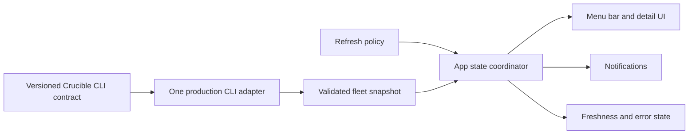

# CodexBar Selective Alignment

- Status: Accepted
- Decision date: 2026-07-15
- Applies to: CRUMAC-2 and the Crucible.app foundation
- Upstream evidence snapshot: [`steipete/CodexBar@d661c1c`](https://github.com/steipete/CodexBar/tree/d661c1c37d00f6520204063e9fa1ca305dfc0f60)

## Decision

**Adopt — use CodexBar as a selective reference implementation, not as a starter kit, source dependency, or product blueprint.**

CodexBar has current, field-tested solutions to problems every serious macOS menu bar utility encounters: native lifecycle, stable status-item behavior, progressive disclosure, refresh coordination, stale and error presentation, concurrency, and test seams. Ignoring those lessons would repeat avoidable mistakes. Copying its architecture would import the complexity of a different product: dozens of providers, direct credentials and local-data probes, widgets, helper processes, a bundled CLI, and mature release infrastructure.

The governing rule is simple: transfer a pattern only when it solves a named Crucible.app requirement today. There is no CodexBar feature-parity, source-parity, or architecture-parity goal.

## Non-negotiable Crucible boundary

CodexBar's provider and fetcher layer does not cross into Crucible.app. The Crucible CLI remains the sole production boundary for all fleet observations and mutations.

The boxes describe responsibilities and test seams, not a requirement to create a package, protocol, service, or file for every box. Begin with the fewest types that keep I/O, state policy, and presentation independently testable.

## Adopt

| CodexBar lesson | Crucible.app application |
|---|---|
| Menu-bar-first information hierarchy | Keep the default surface glanceable and use progressive disclosure for host, job, and lane detail. Do not compress a dashboard into a popover. |
| Stable native lifecycle | Preserve status-item identity, avoid destructive rebuilds while a menu is open, and explicitly cancel tasks and detach status items on termination. |
| One-way snapshot state | Convert each validated CLI result into app state consumed by the icon, menu, details, freshness UI, and notifications. Views do not execute fleet queries. |
| Refresh as policy | Run CLI work off the main actor, prevent overlapping refreshes, coalesce redundant requests, retain the last known snapshot, and represent loading, stale, incompatible, and failed states explicitly. |
| Narrow native surface | Use SwiftUI for app structure, settings, and ordinary views; bridge to AppKit only where menu bar lifecycle or interaction actually requires it. |
| Model-first verification | Drive parsing, refresh rules, transitions, alert deduplication, and view models with CLI fixtures. Reserve AppKit tests for wiring and lifecycle, plus a packaged-app launch and teardown smoke test. |
| Concurrency correctness | Enable strict Swift concurrency and make actor ownership explicit from the first implementation rather than retrofitting it after UI and polling code spread. |

## Adapt

| CodexBar pattern | Crucible.app adaptation |
|---|---|
| Many provider implementations behind common fetch/state machinery | Use one narrow injectable CLI boundary for tests and exactly one production implementation that invokes the Crucible CLI. Do not build a provider registry or generalized backend framework. |
| App and CLI sharing a configuration file | The app may own local presentation preferences. Fleet configuration, provenance, validation, and changes stay behind Crucible CLI commands; the app does not read or write fleet configuration files directly. |
| Custom AppKit status menus | Start with Apple's supported SwiftUI menu bar primitives. Add the smallest `NSStatusItem` or custom AppKit surface only after a focused spike demonstrates a required behavior, accessibility need, or update-stability gap. |
| Mature build, signing, and release automation | Begin with the minimum build, test, formatting, signing, and Sparkle checks needed for the current release. Add packaging matrices or release automation only when an actual distribution requirement appears. |
| Provider-specific state inference | Put pipeline state, token accounting, time bounds, recoveries, and freshness semantics in the versioned CLI response. The app renders and alerts on those semantics; it does not reconstruct them. |

## Reject

- Copying or forking CodexBar source, file structure, or extension topology.
- A generalized provider framework, provider registry, or speculative support for a second fleet backend.
- Direct host connections or direct reads of credentials, cookies, browser storage, logs, databases, or agent files.
- Reimplementing token attribution, pipeline-state inference, configuration validation, or other Crucible domain logic in the app.
- Bundling another Crucible CLI, widget, helper executable, cross-platform CLI release, or background service without its own approved requirement.
- Importing CodexBar's dependency graph, complete CI matrix, release machinery, or visual feature set merely for consistency with upstream.
- Tracking upstream parity after the app foundation is established.

## Implementation test

Every proposed CodexBar-derived pattern must answer all three questions in its plan or pull request:

1. Which current Crucible.app requirement or observed macOS failure mode does this solve?
2. What is the smallest native implementation that preserves the CLI-only boundary?
3. What evidence will prove the pattern works without making unrelated architecture permanent?

If those answers are absent, leave the pattern out.

## Reversal and review triggers

- If a focused spike proves SwiftUI's menu bar primitives cannot satisfy a required interaction, accessibility behavior, or stable live update, adopt the smallest necessary AppKit bridge and record the evidence. This changes the UI implementation choice, not the CLI boundary.
- If a second production data source is proposed, first unify it behind the Crucible CLI. A generalized app provider layer requires a Strategy and ProductSpec revision; it must not emerge from anticipatory abstraction.
- If the CLI contract cannot express intelligence the app needs, extend and version the CLI contract. Do not work around the gap with direct host access or app-only inference.
- If an adopted pattern grows more conceptual surface than the current requirement, simplify or remove it. Any knowingly retained tradeoff belongs in the Decision Trace.

## Evidence behind the decision

CodexBar documents a split between fetch/parse responsibilities and app state/UI, a refresh policy independent of presentation, and a hybrid SwiftUI/AppKit lifecycle. Its issue history also records failures around rebuilding open menus, incomplete status-item teardown, polling cost, layered cache staleness, and domain-specific token accounting. Those are useful warnings, but they support selective transfer rather than source reuse.

- [Architecture](https://github.com/steipete/CodexBar/blob/d661c1c37d00f6520204063e9fa1ca305dfc0f60/docs/architecture.md)
- [Refresh loop](https://github.com/steipete/CodexBar/blob/d661c1c37d00f6520204063e9fa1ca305dfc0f60/docs/refresh-loop.md)
- [UI implementation notes](https://github.com/steipete/CodexBar/blob/d661c1c37d00f6520204063e9fa1ca305dfc0f60/docs/ui.md)
- [Development and lifecycle](https://github.com/steipete/CodexBar/blob/d661c1c37d00f6520204063e9fa1ca305dfc0f60/docs/DEVELOPMENT.md)
- [Open-menu rebuild regression](https://github.com/steipete/CodexBar/issues/944)
- [Status-item teardown regression](https://github.com/steipete/CodexBar/issues/1174)
- [Polling and enrichment cost](https://github.com/steipete/CodexBar/issues/1033)
- [Layered cache staleness](https://github.com/steipete/CodexBar/issues/2089)
- [Token-accounting correctness](https://github.com/steipete/CodexBar/issues/2037)
